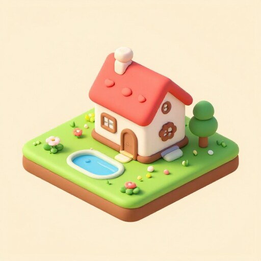
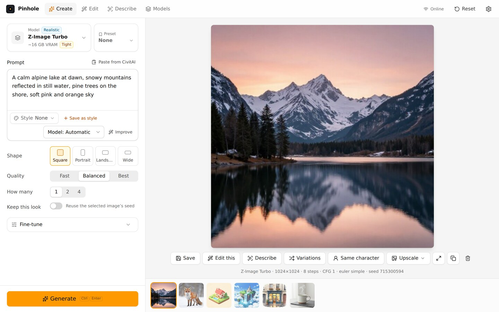
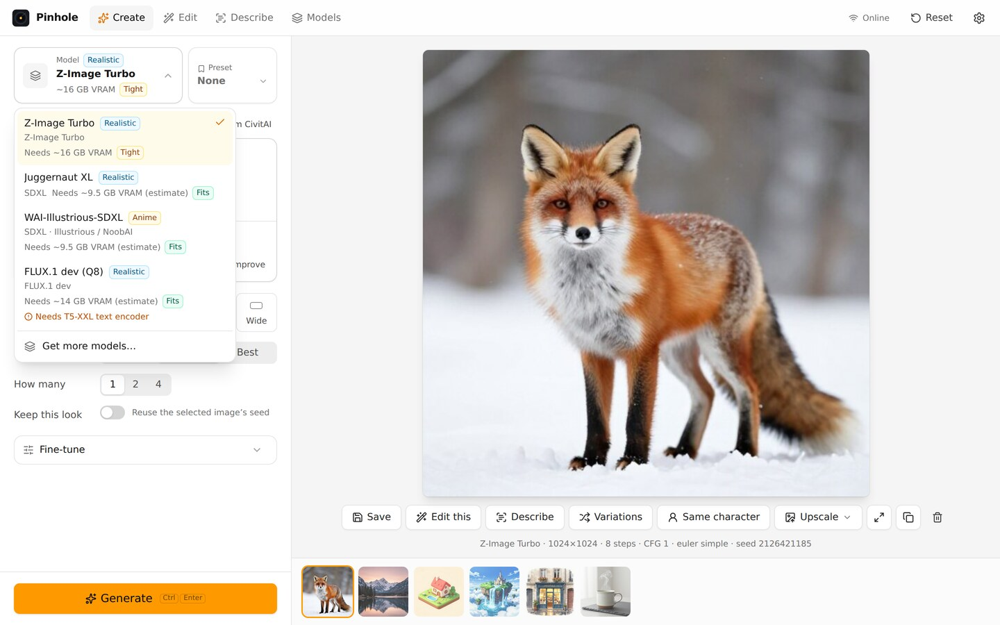
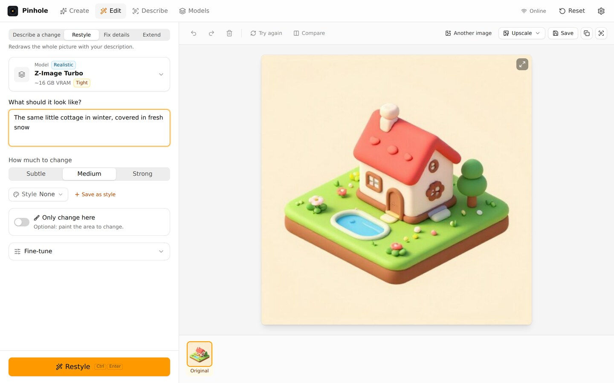

# Pinhole

A simple AI image generator that runs on your own computer. Pick a model, type what you want to
see, press **Generate**. No account, no cloud, no node graphs.

| | | |
|---|---|---|
|  |  |  |
|  |  |  |

<sub>Made with Pinhole's image engine and Z-Image Turbo (Apache 2.0), unedited. Prompts and settings: [docs/examples](docs/examples/README.md).</sub>

## What it does

- **Create** pictures from a sentence, **Edit** them ("make it evening", "replace the mug with a
  bottle"), and **Describe** a picture to get a prompt back.
- **The right model for your GPU, one click.** Pinhole detects your graphics card and recommends
  models that fit. Everything else (text encoders, VAE, steps, sampler) is set up for you, and
  every choice can be seen and changed in the **Fine-tune** drawer.
- **Built-in CivitAI browser** with plain filters and Safe mode on by default.
- **Your prompts and images stay on your computer.** Pinhole only goes online when you browse
  models, download something or press **Check for updates**, and **Offline mode** turns that off.
  Nothing is saved until you press Save.

Windows 10/11 and Linux. NVIDIA, AMD and Intel GPUs, or the processor (slow). Powered by
[stable-diffusion.cpp](https://github.com/leejet/stable-diffusion.cpp) and
[llama.cpp](https://github.com/ggml-org/llama.cpp).

| Create | Pick a model that fits | Edit |
|---|---|---|
|  |  |  |

## Download

Get the latest version from [Releases](../../releases):

| System | File |
|---|---|
| Windows 10/11, installer | `Pinhole-<version>-windows-x64-setup.exe` |
| Windows 10/11, portable | `Pinhole-<version>-windows-x64-portable.zip` (unzip, run `Pinhole.exe`) |
| Linux (Ubuntu 24.04+ or glibc 2.38+) | `Pinhole-<version>-linux-x86_64.AppImage` or `-linux-amd64.deb` |

Windows may warn that the app is from an unknown publisher (it isn't code-signed yet): choose
**More info → Run anyway**. On Linux, NVIDIA RTX 30xx and newer use CUDA (with the NVIDIA driver); other cards use Vulkan.

## First steps

1. Open Pinhole and read the short usage guidelines.
2. It downloads the image engine for your GPU once, and shows the recommended models. Click
   **Get** on one (models are 2 to 25 GB).
3. Type what you want to see and press **Generate** (Ctrl+Enter).

Models come from Hugging Face and CivitAI and keep their own licences, shown on each model's card.
Models, settings and saved pictures are in one `Data` folder (**Settings → Open Data folder**).

## Safety

Like other AI image tools, Pinhole has safeguards against harmful content. Unlike most, it does
this with AI running entirely on your own computer. [SAFETY.md](SAFETY.md) explains how they work
and how to report a problem; the usage guidelines are shown when Pinhole first opens.

## Build from source

You need [Rust](https://rustup.rs), Node.js 22 and the
[Tauri 2 prerequisites](https://v2.tauri.app/start/prerequisites/).

```sh
npm ci
npm run tauri dev      # run the app
npm run tauri build    # installers in target/release/bundle/
scripts/check.sh       # tests, lints and the privacy checks
```

Start with [docs/PROJECT-BRIEF.md](docs/PROJECT-BRIEF.md) (status and decisions),
[docs/SPEC.md](docs/SPEC.md) (what Pinhole does) and [docs/ARCHITECTURE.md](docs/ARCHITECTURE.md)
(how it's built). Contributors also read [CLAUDE.md](CLAUDE.md), which holds the privacy and
wording rules.

## License

MIT, see [LICENSE](LICENSE). Third-party licences are in
[THIRD_PARTY_LICENSES](THIRD_PARTY_LICENSES). Models are not part of Pinhole.
